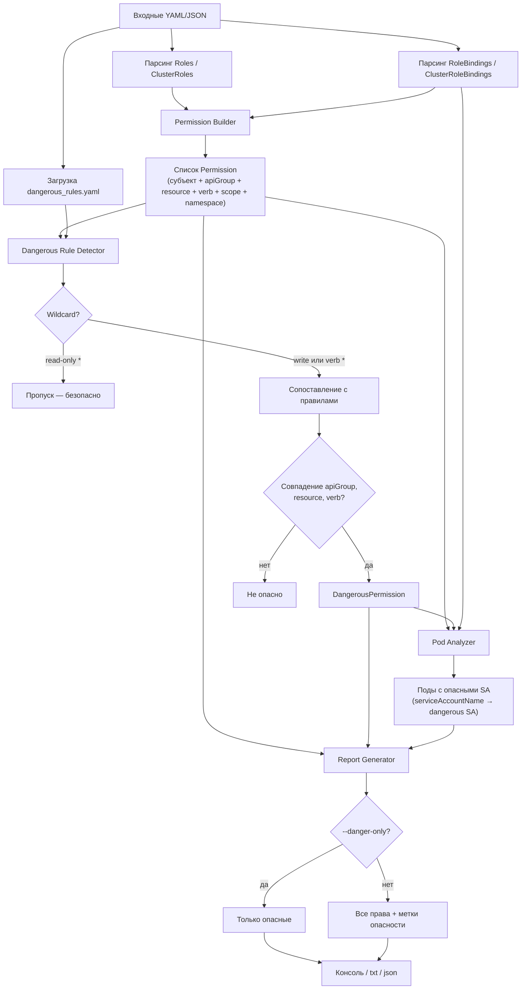

# Алгоритм работы RBAC Analyzer

## Схема

## Этапы

### 1. Парсинг

- Чтение мульти-документных YAML-файлов (`---`)
- Построение моделей: `Role`, `Binding`, `Subject`, `Rule`

### 2. Permission Builder

Для каждого binding:

1. Найти роль по `roleRef.kind` + `roleRef.name`
2. Для каждого subject и каждого rule развернуть декартово произведение `apiGroups × resources × verbs`
3. Определить scope:
   - `ClusterRoleBinding` → `scope: cluster`, `namespace: null`
   - `RoleBinding` → `scope: namespace`, `namespace: <binding.namespace>`

### 3. Dangerous Rule Detector

Для каждого permission:

1. Если `is_safe_wildcard()` — пропуск
2. Иначе для каждого правила из конфига проверить совпадение полей (с учётом `*`)
3. При совпадении — добавить `DangerousPermission` с severity и описанием

### 4. Отчёт

- Группировка по субъекту (`kind`, `name`, `sa-namespace`)
- Для каждого права: `[cluster]` или `[namespace:<ns>]`, apiGroup/resource/verb
- Секция dangerous permissions с правилом и причиной
